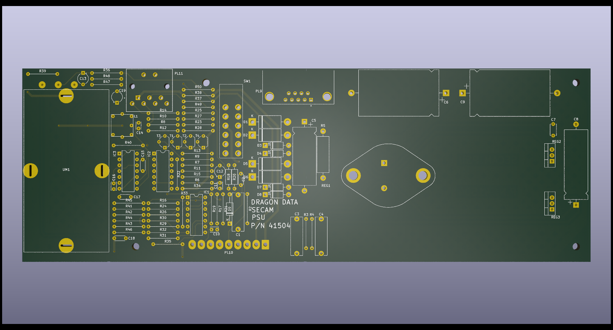
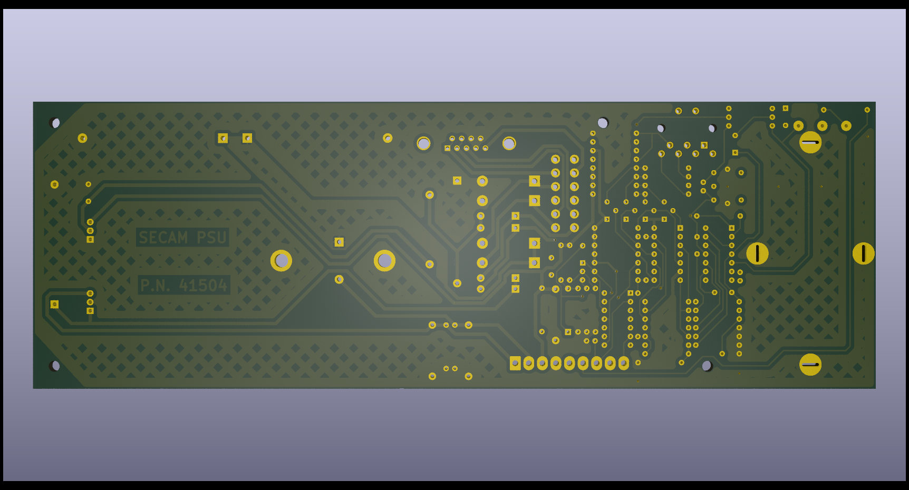

# SECAM Dragon 32 Power Board

This project is a historic record of the Dragon 32 SECAM power board.
Part Number 41504. This is not intended for fabrication but should be
dimensionally correct.

The board is unique in that it contains a full YPrPb conversion to
RGB - something very lacking from the original design

## Compatibility

This board can only be used with a SECAM version of the main CPU
board, see https://github.com/jimbro1000/Dragon32Issue2aSecam